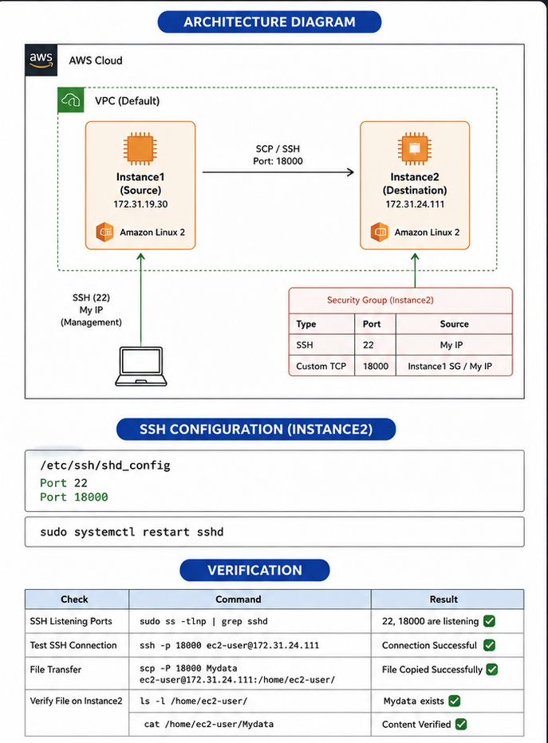

# 🚀 AWS EC2 Secure File Transfer Using Custom SSH Port (18000)

<p align="center">
  
</p>

<p align="center">


</p>

---

## 📖 Overview

This project demonstrates how to securely transfer files between two AWS EC2 instances using a **custom SSH port (18000)** instead of the default SSH port (22).

The objective was to:

- Launch two AWS EC2 instances
- Configure SSH to listen on port **18000**
- Update AWS Security Group rules
- Configure SELinux for the new SSH port
- Transfer files securely using **SCP**
- Verify successful file transfer

---

# 🏗 Architecture

```
                      AWS Cloud
        ┌──────────────────────────────────────┐
        │                                      │
        │          Default VPC                 │
        │                                      │
        │  ┌──────────────┐                    │
        │  │  Instance-1  │                    │
        │  │   Source     │                    │
        │  │ Amazon Linux │                    │
        │  └──────┬───────┘                    │
        │         │                            │
        │     SCP / SSH                        │
        │     Port 18000                       │
        │         │                            │
        │         ▼                            │
        │  ┌──────────────┐                    │
        │  │  Instance-2  │                    │
        │  │ Destination  │                    │
        │  │ Amazon Linux │                    │
        │  └──────────────┘                    │
        │                                      │
        └──────────────────────────────────────┘
```

---

# 🛠 Technologies Used

- AWS EC2
- Amazon Linux
- SSH
- SCP
- SELinux
- Security Groups
- Linux Terminal

---

# 📂 Project Structure

```
aws-ec2-custom-ssh-port/
│
├── README.md
├── architecture.png
└── screenshots
    ├── 01-launch-instance.png
    ├── 02-security-group.png
    ├── 03-ssh-config.png
    ├── 04-semanage.png
    ├── 05-verify-port.png
    ├── 06-scp-transfer.png
    └── 07-verification.png
```

---

# 🚀 Step 1 — Launch Two EC2 Instances

Launch two Amazon Linux EC2 instances.

| Instance | Purpose |
|----------|----------|
| Instance-1 | Source |
| Instance-2 | Destination |

---

# 🔐 Step 2 — Configure Security Group

On **Instance-2**, add the following inbound rules:

| Type | Port | Source |
|------|------|--------|
| SSH | 22 | My IP |
| Custom TCP | 18000 | My IP / Instance1 Security Group |

---

# ⚙ Step 3 — Configure SSH

Open the SSH configuration file.

```bash
sudo vi /etc/ssh/sshd_config
```

Add:

```text
Port 22
Port 18000
```

---

# 🔒 Step 4 — Configure SELinux

Allow SSH to use the new port.

```bash
sudo semanage port -a -t ssh_port_t -p tcp 18000
```

Verify:

```bash
sudo semanage port -l | grep ssh
```

Expected output:

```
ssh_port_t    tcp    22,18000
```

---

# 🔄 Step 5 — Restart SSH

```bash
sudo systemctl restart sshd
```

Verify:

```bash
sudo systemctl status sshd
```

---

# ✅ Step 6 — Verify SSH Port

```bash
sudo ss -tlnp | grep sshd
```

Expected output:

```
LISTEN 0 128 0.0.0.0:22
LISTEN 0 128 0.0.0.0:18000
```

---

# 📄 Step 7 — Create a File

On **Instance-1**

```bash
echo "Hello AWS" > Mydata
```

---

# 📤 Step 8 — Transfer File

```bash
scp -P 18000 Mydata ec2-user@<PRIVATE-IP>:/home/ec2-user/
```

---

# ✔ Step 9 — Verify File

On **Instance-2**

```bash
ls -l
cat Mydata
```

Expected output:

```
Hello AWS
```

---

# 📋 Verification Checklist

- [x] Launched two EC2 instances
- [x] Configured AWS Security Group
- [x] Added SSH custom port (18000)
- [x] Updated SELinux policy
- [x] Restarted SSH service
- [x] Verified SSH is listening on port 18000
- [x] Successfully transferred file using SCP
- [x] Verified file on destination instance

---

# 🎯 Key Learnings

- Launching EC2 instances
- AWS Security Groups
- SSH daemon configuration
- SELinux port management
- SCP file transfer
- Linux networking
- Secure communication using custom SSH ports

---

# 📸 Screenshots

Add screenshots here.

| Screenshot | Description |
|------------|-------------|
| Launch EC2 | Creating EC2 instances |
| Security Group | Adding port 18000 |
| SSH Config | Editing sshd_config |
| SELinux | Configuring ssh_port_t |
| Verify Port | `ss -tlnp` output |
| SCP Transfer | File copied successfully |
| Verification | File exists on Instance-2 |

---

# 📚 Commands Used

```bash
# Edit SSH configuration
sudo vi /etc/ssh/sshd_config

# Configure SELinux
sudo semanage port -a -t ssh_port_t -p tcp 18000

# Restart SSH
sudo systemctl restart sshd

# Verify SSH
sudo ss -tlnp | grep sshd

# Create file
echo "Hello AWS" > Mydata

# Copy file
scp -P 18000 Mydata ec2-user@<PRIVATE-IP>:/home/ec2-user/

# Verify
ls -l
cat Mydata
```

---

# 🎉 Result

✔ Successfully configured SSH to use a custom port (**18000**) on AWS EC2.

✔ Successfully transferred files securely between two EC2 instances using **SCP**.

✔ Verified the transferred file on the destination instance.

---

## 👨‍💻 Author

**Ismail Shaikh**

Cloud & DevOps Enthusiast

- 🐧 Linux
- ☁ AWS
- 🐳 Docker
- 🔄 Git & GitHub
- ⚙ DevOps
- 🏅 RHCSA Certified

---

⭐ **If you found this project useful, don't forget to star the repository!**
